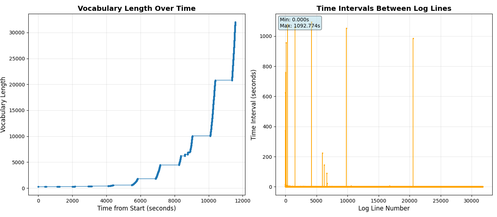

## Problem (unicode1)
```
>>> chr(0)
'\x00'
>>> repr(chr(0))
"'\\x00'"
>>> print(chr(0))

>>> "this is a test" + chr(0) + "string"
'this is a test\x00string'
>>> print("this is a test" + chr(0) + "string")
this is a teststring
```
(a) `chr(0)` returns the unicode with code point 0. 
(b) The string representation (__repr__()) is "'\\x{HEX}'", whereas the printed representation is invisible.
(c) When it occurs in text, it's invisible. It's unprintable but stringable.

## Problem (unicode2)
(a)
```
>>> len(list("hello".encode("utf-8")))
5
>>> len(list("hello".encode("utf-16")))
12
>>> len(list("hello".encode("utf-32")))
24
```
The output is shorter.

(b) This is decoding at byte level. However, each character might map to more than one byte in UTF-8. 

```
>>> decode_utf8_bytes_to_str_wrong("你好".encode("utf-8"))
Traceback (most recent call last):
  File "<stdin>", line 1, in <module>
  File "<stdin>", line 2, in decode_utf8_bytes_to_str_wrong
UnicodeDecodeError: 'utf-8' codec can't decode byte 0xe4 in position 0: unexpected end of data
```
(c) Utf-8 specifies that 1-byte sequence must be `0xxxxxxx`, and 2-byte sequence must starts with `110xxxxx`, and 3-byte sequence must starts with `1110xxxx`. A 2-byte sequence starting with `1110xxxx` is invalid.
```
>>> bytes([254,254]).decode('utf-8')
Traceback (most recent call last):
  File "<stdin>", line 1, in <module>
UnicodeDecodeError: 'utf-8' codec can't decode byte 0xfe in position 0: invalid start byte
```


## Problem (train_bpe_tinystories)

```
$ uv run -m src.train_bpe train ../data/TinyStoriesV2-GPT4-train.txt ../ts-train-bpe.pkl 10000
$ uv run -m src.train_bpe read ../ts-train-bpe.pkl
```

(a) It takes about 1.5min on CPU. The longest token in the vocabulary is `b' accomplishment'`. 

Without priority-queue optimization, this takes 7min on CPU.

(b) It spends a lot of time in finding the next token with the highest frequency. We could make this more efficient using a heap / priority-queue.

```
   Ordered by: internal time

   ncalls  tottime  percall  cumtime  percall filename:lineno(function)
196097110   20.773    0.000   35.846    0.000 bpe.py:74(comp_frequency_then_pair)
    19525   17.578    0.001   53.424    0.003 {built-in method builtins.max}
196097220   15.073    0.000   15.073    0.000 {method 'get' of 'dict' objects}
       24    0.472    0.020    0.472    0.020 {built-in method posix.read}
        1    0.386    0.386   54.416   54.416 bpe.py:81(train_bpe)
       10    0.080    0.008    0.080    0.008 {built-in method _io.open}
```


## Problem (train_bpe_expts_owt)

```
$ uv run -m src.train_bpe train ../data/owt_valid.txt ../owt-val-bpe.pkl 32000
```

Training on the validation set took about 3.5 minutes, using a peak memory of around 3G. The longest token in the vocabulary is `b'abc'`.Without the priority-queue optimizaiton, it takes about 53mins on CPU.

```
$ uv run -m experiments.train_bpe train --input ../data/owt_train.txt --output-file ../owt-train-bpe.pkl --vocab-size 32000
```

Training on the training set took about 3.5 hours, using a peak memory of around 20G. I think the following ingredients are important: (1) priority-queue optimization for selecting pair to merge (2) batched frequency-update to reduce overhead of using priority-queue, (3) parallel pretokenization with small chunk size to avoid OOMing my 16GB Mac.

The longest token is `ÃÂÃÂÃÂÃÂÃÂÃÂÃÂÃÂÃÂÃÂÃÂÃÂÃÂÃÂÃÂÃÂ`, which takes 64 bytes (each `Â` is 4 byte in utf-8). This makes sense because the text contains long sequences of `Â`s.

Note about training:

```
$ uv run -m experiments.owt_train_bpe_visualize ../owt-train-bpe.log
Parsing log file: ../owt-train-bpe.log
Successfully parsed 31743 vocab entries

==================================================
TIME BETWEEN LOG LINES STATISTICS
==================================================
Min time between log lines: 0.000000 seconds
Max time between log lines: 1092.774000 seconds
Average time between log lines: 0.364283 seconds
Median time between log lines: 0.005000 seconds

==================================================
VOCAB PROCESSING ANALYSIS
==================================================
Total pairs processed: 15871
Average processing time: 0.370254 seconds

Vocab pairs taking more than 1 minute to process:
  (b'i', b't') -> 625.189000 seconds (10.42 minutes)
  (b'a', b'd') -> 760.342000 seconds (12.67 minutes)
  (b'i', b'b') -> 1078.598000 seconds (17.98 minutes)
  (b'\xc3', b'\x83') -> 146.270000 seconds (2.44 minutes)
  (b'd', b's') -> 1051.840000 seconds (17.53 minutes)
  (b'S', b'F') -> 984.581000 seconds (16.41 minutes)
==================================================
```

It seems that certain pairs (6 out of 32000) are very expensive to merge (longer than 1 minute), while others are very cheap (the medium and average are well under 0.5s).



## Problem (tokenizer_experiments)

Performance comparison:

* TS valid
  * My tokenizer (multi-process): 8 seconds
  * Tiktoken (single thread): 1.5 second
  * Compression ratio: 4.12
* TS train:
  * My tokenizer (multi-process): 35 min
  * Tiktoken (single thread): 3min
  * Compression ratio: 4.11
* OWT valid:
  * My tokenizer (multi-process): 35min
  * Tiktoken (single thread): 20s
  * Compression ratio: 4.37
* OWT train:
  * My tokenizer (multi-process): doesn't finish after 10 hours
  * Tiktoken (single thread): 

Encoding takes about 12 seconds on TS valid, about 35min on TS train, about 35min on OWT valid.

```
$ time uv run -m experiments.tokenizer_experiment encode --bpe-file ../ts-valid-bpe.pkl --input-file ../data/TinyStoriesV2-GPT4-valid.txt --output-file ../ts-valid-encoded.npy
Encoding output length: 5461747
Input length: 22502601
Byte per token: 4.12
Token IDs saved to ../ts-valid-encoded.npy.npy
uv run -m experiments.tokenizer_experiment encode --bpe-file  --input-file     12.97s user 0.11s system 98% cpu 13.248 total

$ time uv run -m experiments.tokenizer_experiment encode --bpe-file ../ts-train-bpe.pkl --input-file ../data/TinyStoriesV2-GPT4-train.txt --output-file ../ts-train-encoded.npy
Encoding output length: 541229347
Input length: 2227753162
Byte per token: 4.11
Token IDs saved to ../ts-train-encoded.npy.npy
uv run -m experiments.tokenizer_experiment encode --bpe-file  --input-file     2123.18s user 10.61s system 99% cpu 35:36.77 total

$ time uv run -m experiments.tokenizer_experiment encode --bpe-file ../owt-valid-bpe.pkl --input-file ../data/owt_valid.txt --output-file ../owt-valid-encoded.npy
Encoding output length: 66296750
Input length: 289998753
Byte per token: 4.37
Token IDs saved to ../owt-valid-encoded.npy.npy
uv run -m experiments.tokenizer_experiment encode --bpe-file  --input-file     2134.74s user 8.50s system 99% cpu 35:48.59 total
```

(b) It would still work but the compression rate will be lower.

(c) This depends on the vocab size. 

* If we approximate using tiny-stories training set results. Vocab = 10000, text size = 2.23GB, time = 35min, speed = 1 MB/s.
* If we approxmiate using owt_valid.txt results. Vocab_size = 32000, text size = 290MB, time = 35min, speed = 0.15MB/s.

It would take... really long for my tokenizer.

For single-thread tiktoken, 

* If we approximate using tiny-stories training set results. Vocab = 10000, text size = 2.23GB, time = 3min, speed = 13 MB/s.
* If we approxmiate using owt_valid.txt results. Vocab_size = 32000, text size = 290MB, time = 30s, speed = 10MB/s.

(d)

## Notes

BPE's training output could contain invalid UTF-8 because it operates at the byte-level instead of character level (it starts with a vocab of 0-255), thus it could split one UTF-8 character into two subwords.

But why does [GPT-2's vocab](https://huggingface.co/openai-community/gpt2/blob/main/vocab.json) contain only valid UTF-8? The reason is that GPT-2 uses a cleve encoding scheme to map all 256 byte values to valid Unicode characters.

* Printable ASCII bytes (33-126, 161-172, 174-255) map to themselves
* Non-printable bytes (0-32, 127-160, 173) map to Unicode Private Use Area characters

As a result, the vocab file is a representation: The strings in vocab.json are valid UTF-8 representations of arbitrary byte sequences, not the raw bytes themselves
