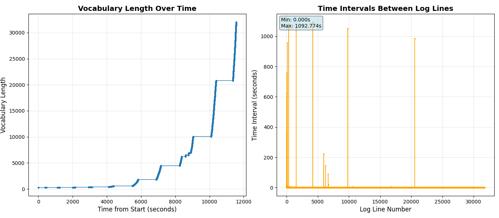

## Problem (unicode1)
```
>>> chr(0)
'\x00'
>>> repr(chr(0))
"'\\x00'"
>>> print(chr(0))

>>> "this is a test" + chr(0) + "string"
'this is a test\x00string'
>>> print("this is a test" + chr(0) + "string")
this is a teststring
```
(a) `chr(0)` returns the unicode with code point 0. 
(b) The string representation (__repr__()) is "'\\x{HEX}'", whereas the printed representation is invisible.
(c) When it occurs in text, it's invisible. It's unprintable but stringable.

## Problem (unicode2)
(a)
```
>>> len(list("hello".encode("utf-8")))
5
>>> len(list("hello".encode("utf-16")))
12
>>> len(list("hello".encode("utf-32")))
24
```
The output is shorter.

(b) This is decoding at byte level. However, each character might map to more than one byte in UTF-8. 

```
>>> decode_utf8_bytes_to_str_wrong("你好".encode("utf-8"))
Traceback (most recent call last):
  File "<stdin>", line 1, in <module>
  File "<stdin>", line 2, in decode_utf8_bytes_to_str_wrong
UnicodeDecodeError: 'utf-8' codec can't decode byte 0xe4 in position 0: unexpected end of data
```
(c) Utf-8 specifies that 1-byte sequence must be `0xxxxxxx`, and 2-byte sequence must starts with `110xxxxx`, and 3-byte sequence must starts with `1110xxxx`. A 2-byte sequence starting with `1110xxxx` is invalid.
```
>>> bytes([254,254]).decode('utf-8')
Traceback (most recent call last):
  File "<stdin>", line 1, in <module>
UnicodeDecodeError: 'utf-8' codec can't decode byte 0xfe in position 0: invalid start byte
```


## Problem (train_bpe_tinystories)

```
$ uv run -m src.train_bpe train ../data/TinyStoriesV2-GPT4-train.txt ../ts-train-bpe.pkl 10000
$ uv run -m src.train_bpe read ../ts-train-bpe.pkl
```

(a) It takes about 1.5min on CPU. The longest token in the vocabulary is `b' accomplishment'`. 

Without priority-queue optimization, this takes 7min on CPU.

(b) It spends a lot of time in finding the next token with the highest frequency. We could make this more efficient using a heap / priority-queue.

```
   Ordered by: internal time

   ncalls  tottime  percall  cumtime  percall filename:lineno(function)
196097110   20.773    0.000   35.846    0.000 bpe.py:74(comp_frequency_then_pair)
    19525   17.578    0.001   53.424    0.003 {built-in method builtins.max}
196097220   15.073    0.000   15.073    0.000 {method 'get' of 'dict' objects}
       24    0.472    0.020    0.472    0.020 {built-in method posix.read}
        1    0.386    0.386   54.416   54.416 bpe.py:81(train_bpe)
       10    0.080    0.008    0.080    0.008 {built-in method _io.open}
```


## Problem (train_bpe_expts_owt)

```
$ uv run -m src.train_bpe train ../data/owt_valid.txt ../owt-val-bpe.pkl 32000
```

Training on the validation set took about 3.5 minutes, using a peak memory of around 3G. The longest token in the vocabulary is `b'abc'`.Without the priority-queue optimizaiton, it takes about 53mins on CPU.

```
$ uv run -m experiments.train_bpe train --input ../data/owt_train.txt --output-file ../owt-train-bpe.pkl --vocab-size 32000
```

Training on the training set took about 3.5 hours, using a peak memory of around 20G. I think the following ingredients are important: (1) priority-queue optimization for selecting pair to merge (2) batched frequency-update to reduce overhead of using priority-queue, (3) parallel pretokenization with small chunk size to avoid OOMing my 16GB Mac.

The longest token is `ÃÂÃÂÃÂÃÂÃÂÃÂÃÂÃÂÃÂÃÂÃÂÃÂÃÂÃÂÃÂÃÂ`, which takes 64 bytes (each `Â` is 4 byte in utf-8). This makes sense because the text contains long sequences of `Â`s.

Note about training:

```
$ uv run -m experiments.owt_train_bpe_visualize ../owt-train-bpe.log
Parsing log file: ../owt-train-bpe.log
Successfully parsed 31743 vocab entries

==================================================
TIME BETWEEN LOG LINES STATISTICS
==================================================
Min time between log lines: 0.000000 seconds
Max time between log lines: 1092.774000 seconds
Average time between log lines: 0.364283 seconds
Median time between log lines: 0.005000 seconds

==================================================
VOCAB PROCESSING ANALYSIS
==================================================
Total pairs processed: 15871
Average processing time: 0.370254 seconds

Vocab pairs taking more than 1 minute to process:
  (b'i', b't') -> 625.189000 seconds (10.42 minutes)
  (b'a', b'd') -> 760.342000 seconds (12.67 minutes)
  (b'i', b'b') -> 1078.598000 seconds (17.98 minutes)
  (b'\xc3', b'\x83') -> 146.270000 seconds (2.44 minutes)
  (b'd', b's') -> 1051.840000 seconds (17.53 minutes)
  (b'S', b'F') -> 984.581000 seconds (16.41 minutes)
==================================================
```

It seems that certain pairs (6 out of 32000) are very expensive to merge (longer than 1 minute), while others are very cheap (the medium and average are well under 0.5s).



## Problem (tokenizer_experiments)

Performance comparison:

* TS valid
  * My tokenizer (multi-process): 8 seconds
  * Tiktoken (single thread): 1.5 second
  * Compression ratio: 4.12
* TS train:
  * My tokenizer (multi-process): 35 min
  * Tiktoken (single thread): 3min
  * Compression ratio: 4.11
* OWT valid:
  * My tokenizer (multi-process): 35min
  * Tiktoken (single thread): 20s
  * Compression ratio: 4.37
* OWT train:
  * My tokenizer (multi-process): doesn't finish after 10 hours
  * Tiktoken (single thread): 17mins. I had to split into chunks to not get OOMed on my 16GB Mac.

(b) It would still work but the compression rate will be lower.

(c) This depends on the vocab size. 

* If we approximate using tiny-stories training set results. Vocab = 10000, text size = 2.23GB, time = 35min, speed = 1 MB/s.
* If we approxmiate using owt_valid.txt results. Vocab_size = 32000, text size = 290MB, time = 35min, speed = 0.15MB/s.

It would take... really long for my tokenizer.

For single-thread tiktoken, 

* If we approximate using tiny-stories training set results. Vocab = 10000, text size = 2.23GB, time = 3min, speed = 13 MB/s.
* If we approxmiate using owt_train.txt results. Vocab_size = 32000, text size = 2.2GB, time = 17min, speed = 12MB/s.

## Problem (transfomer_accounting)

### Parameter Count

- Token embedding: $vocab\_size \times d_{model}$
- Each transformer block: $2 d_{model} + 3 d_{ff} d_{model} + 4 d_{model}^2$
  - RMS Norm before attention: $d_{model}$
  - Attention: $W_Q$, $W_K$, $W_V$ are all $hd \times d_{model}$. $W_O$ is $d_{model} \times hd$. $hd = d_{model}$.
  - RMS Norm before FFN: $d_{model}$
  - FFN: $W_1$, $W_2$ and $W_3$, in total $3 d_{ff} d_{model}$.
- Output RMS norm: $d_{model}$
- Output embedding: $d_{model} \times vocab\_size$
- Total: $$vocab\_size \times d_{model} + L(2 d_{model} + 4 d_{model}^2 + 3 d_{ff} d_{model}) + d_{model} + d_{model} \times vocab\_size$$

For GPT-2 XL, vocab_size : 50,257, context_length : 1,024, num_layers : 48, d_model : 1,600, num_heads : 25, d_ff : 6,400. Total parameter count is roughly 1.5B.

### FLOP Count

We only count matrix multiplications.

- Token embedding: 0
- Each transformer block:
  - Attention:
    - $W_Q x$: $d_{model} \times d_{model}$ and $n \times d_{model}$
    - $W_K x$: $d_{model} \times d_{model}$ and $n \times d_{model}$
    - $W_V x$: $d_{model} \times d_{model}$ and $n \times d_{model}$
    - $QK^T$: $n \times d_{model}$ and $d_{model} \times n$.
    - Attention-weighted value. Attention is $n \times n$ and $V$ is $n \times d_{model}$.
    - $W_O$ Concatenated output: $d_{model} \times d_{model}$ and $n \times d_{model}$
    - Total FLOPs: $8 n d_{model}^2 + 4 n^2 d_{model}$. Note that the number of heads doesn’t matter given that $h d = d_{model}$.
  - SwiGLU:
    - $W_1 x$: $d_{ff} \times d_{model}$ and $n \times d_{model}$
    - $W_2 x$: $d_{model} \times d_{ff}$ and $n \times d_{model}$
    - $W_3 x$: $d_{ff} \times d_{model}$ and $n \times d_{model}$
    - Total FLOPs: $6 d_{model} d_{ff}$
- RMS norm: 0
- Output embedding: $d_{model} \times V$ and $n \times d_{model}$.

Total FLOP: $L (8 n d_{model}^2 + 4 n^2 d_{model} + 6 d_{model} d_{ff}) + 2 n d_{model} V$. Assume $d_{ff} = 4 d_{model}$, then total FLOP is $L (8 n d_{model}^2 + 4 n^2 d_{model} + 24 d_{model}^2) + 2 n d_{model} V$.

When sequence is short ($n << d_{model}$), the FFN dominates. When sequence is longer ($n  \sim d_{model}$), the attention dominates.

## Problem (learning_rate_tuning)

Skipped

## Problem (admwAccounting)

(a) Parameters, activations, gradients, and optimizer states.

### Parameter Count

- Token embedding: $V \times d*{model}$
- Each transformer block: $2 d_{model} + 3 d_{ff} d_{model} + 4 d_{model}^2$
  - RMS Norm before attention: $d_{model}$
  - Attention: $W_Q$, $W_K$, $W_V$ are all $hd \times d_{model}$. $W_O$ is $d_{model} \times hd$. $hd = d_{model}$.
  - RMS Norm before FFN: $d_{model}$
  - FFN: $W_1$, $W_2$ and $W_3$, in total $3 d_{ff} d_{model}$.
- Output RMS norm: $d_{model}$
- Output embedding: $d_{model} \times vocab\_size$.
- In total, $V \times d*{model} + L(2 d_{model} + 16 d_{model}^2)) + d_{model} + vocab\*size \times d*{model}$, assuming $d_{ff} = 4 d_{model}$.

For GPT-2 XL, vocab_size : 50,257, context_length : 1,024, num_layers : 48, d_model : 1,600, num_heads : 25, d_ff : 6,400. Total parameter count is roughly 1.5B.

### Activations Size Count

Activations are outputs of each layer. They are required to perform backpropagation because chain rule requires intermediate result to propagate the gradient backwards.

To estimate the size of activations of a network, sum the output size of each layer. Note that this depends on batch size, sequence length, etc.

Let’s assume $d_{ff} = 4 \times d_{model}$. Let $b$ be the batch size, and $n$ be the sequence length.

- Each transformer block:
  - RMSNorm: $b \times n \times d_{model}$, 2 in each block.
  - Multi-head self-attention
    - QKV Projections: Each is $b \times n \times d_{model}$, so $3 b \times n \times d_{model}$
    - QK matrix: $b \times n \times n$
    - softmax: $b \times n \times n$
    - weighted sum: $b \times n \times d_{model}$
    - output projection: $b \times n \times d_{model}$
  - Position-wise feed-forward
    - $W_1 x$: $b \times n \times 4 d_{model}$
    - SiLU: Same as $W_1 x$: $b \times n \times 4 d_{model}$
    - $W_3 x$: $b \times n \times 4 d_{model}$
    - $W_2 x$: $b \times n \times d_{model}$
  - In total, each block takes $20 b n  d_{model} + 2 b n^2$
- Final RMSNorm: $b \times n \times d_{model}$
- Output embedding: $b \times n \times d_{model}$
- Cross-entropy on logits: $b \times n$
- In total, $L(20 b n  d_{model} + 2 b n^2) + 2 b n d_{model} + bn$

### Gradient Size Count

The size of gradient is same as learnable model parameters.

### AdamW Optimizer State

The optimizer state is constant size except for first moment vector and second moment vector. Each is the same as gradient, which is the same as the learnable parameter size.

### AdamW Accounting

The peak memory required for running AdamW on a transformer is the sum of parameters, activations, gradients, and optimizer states.

Let’s $P = V \times d_{model} + L(2 d_{model} + 16 d_{model}^2)) + d_{model} + V  \times d_{model}$ be the total parameters.

$$ Peak\ Memory = params + activations + gradients + optimizer\ states \\ = P + L(20 b n  d_{model} + 2 b n^2) + 2 b n d_{model} + bn + P + 2P $$

(b) To derive an expression for the **maximum batch size** $b_{\text{max}}$ given:

- $M$: total GPU memory in bytes (e.g., $80 \times 2^{30}$ for 80 GB)
- $n$: sequence length
- $d$: model hidden size (i.e., $d_{\text{model}}$)
- $L$: number of transformer layers
- $V$: vocabulary size
- Assume training with AdamW using **float32** for everything (you can adjust for mixed-precision later)

This is to solve
$$
16(Vd+16Ld^2)+4[L(20bnd+2bn^2)+2bnd+bn] ≤ M
$$
Note we approximate $$P$$ a bit to ignore small terms.

The end result is 
$$
b_{max} = ⌊ \frac{M−16(Vd+16 L d^2 )}{4 [L(20nd+2 n^2 )+2nd+n]}⌋
$$


With GPT2-XL and 80GB GPU memory, the max batch size is actually 1...

## Notes

BPE's training output could contain invalid UTF-8 because it operates at the byte-level instead of character level (it starts with a vocab of 0-255), thus it could split one UTF-8 character into two subwords.

But why does [GPT-2's vocab](https://huggingface.co/openai-community/gpt2/blob/main/vocab.json) contain only valid UTF-8? The reason is that GPT-2 uses a cleve encoding scheme to map all 256 byte values to valid Unicode characters.

* Printable ASCII bytes (33-126, 161-172, 174-255) map to themselves
* Non-printable bytes (0-32, 127-160, 173) map to Unicode Private Use Area characters

As a result, the vocab file is a representation: The strings in vocab.json are valid UTF-8 representations of arbitrary byte sequences, not the raw bytes themselves
